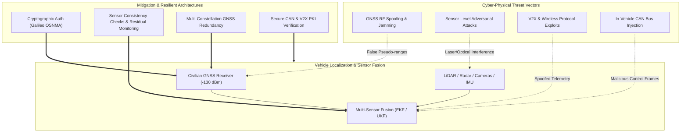

# Cybersecurity of Navigation & Positioning Systems in Autonomous Vehicles

A comprehensive technical study and vulnerability analysis evaluating the cybersecurity risks facing Global Navigation Satellite Systems (GNSS), multi-sensor localization architectures, and Vehicle-to-Everything (V2X) communication channels in modern autonomous and connected vehicles.

---

## Table of Contents

- [Executive Summary](#executive-summary)
- [Core Vulnerability Taxonomy](#core-vulnerability-taxonomy)
- [Research Focus Areas](#research-focus-areas)
- [Defense & Resilient Architecture Strategies](#defense--resilient-architecture-strategies)
- [Repository Artifacts](#repository-artifacts)
- [Primary References & Deliverables](#primary-references--deliverables)
- [Author](#author)

---

## Executive Summary

Civilian Global Navigation Satellite System (GNSS) signals—including GPS (USA), GLONASS (Russia), Galileo (EU), and BeiDou (China)—are broadcast without cryptographic authentication. Arriving at Earth receivers with an extremely low signal power level of approximately **$-130\text{ dBm}$** (billions of times weaker than standard Wi-Fi), civilian satellite positioning signals are inherently susceptible to radio-frequency (RF) jamming, intentional replay, and adversarial spoofing attacks.

As modern autonomous vehicles fuse GNSS positioning with onboard perceptual sensors (LiDAR, Radar, Cameras, and IMUs) and external communication networks (V2X, DSRC, 5G-V2X, and In-Vehicle CAN networks), safety-critical navigation systems face a significantly broadened cyber-physical attack surface.

---

## Core Vulnerability Taxonomy



---

## Research Focus Areas

### 1. GNSS & Satellite Positioning Vulnerabilities
- **Signal Weakness**: Atmospheric attenuation resulting in $\approx -130\text{ dBm}$ incident power at the antenna.
- **Unauthenticated Civilian Broadcasts**: Absence of cryptographic signatures on civilian L1/E1 bands, permitting low-cost Software-Defined Radios (SDRs like HackRF/BladeRF) to transmit fraudulent ephemeris and pseudo-range signals.
- **Attack Manifestations**: Position spoofing (inducing trajectory divergence) and time-synchronization attacks (disrupting coordinated sensor timestamping).

### 2. Sensor-Level Cyber-Physical Attacks
- **Optical & Camera Interference**: Optical blinding, laser dazzling, and adversarial patch attacks misleading visual odometry and object detection.
- **LiDAR & Radar Jamming**: Photodiode saturation and acoustic/RF echo spoofing altering perceived obstacle distance and road boundaries.
- **Inertial Drift Exploitation**: Gradual GPS drift injection designed to evade threshold-based IMU consistency monitors.

### 3. Communication Networks (V2X & In-Vehicle CAN)
- **V2X Channels**: Exploitation of unauthenticated Basic Safety Messages (BSMs), Sybil attacks, and message injection across Dedicated Short-Range Communications (DSRC) and Cellular-V2X (C-V2X).
- **In-Vehicle Networks**: Controller Area Network (CAN) bus vulnerabilities, including lack of payload encryption and bus arbitration vulnerabilities enabling frame spoofing.

---

## Defense & Resilient Architecture Strategies

1. **Cryptographic Signal Verification**:
   - Adoption of **Galileo Open Service Navigation Message Authentication (OSNMA)** and Chips-out-of-Band authentication to verify signal origin.
2. **Kalman Filter Innovation / Residual Monitoring**:
   - Implementation of statistical fault-detection filters (Normalized Innovation Squared - NIS) to detect and reject sudden or unnatural sensor measurements.
3. **Multi-Constellation & Multi-Frequency Receivers**:
   - Cross-verifying positions across independent constellations (GPS L1/L5, Galileo E1/E5, BeiDou B1/B2) to detect single-frequency spoofing attempts.
4. **Hardware-Anchored PKI for V2X**:
   - Strict elliptic-curve cryptographic signing of all V2X communications using Hardware Security Modules (HSMs).

---

## Repository Artifacts

```text
Navigation_and_Positioning_Systems_Autonomous_Vehicles_Project/
├── My_Report.pdf       # Comprehensive engineering research report and vulnerability analysis
├── Presentaion.pdf     # Slide presentation breaking down cyber-physical threat vectors and defenses
├── My_Vedio.mp4        # Presentation and walkthrough video
└── README.md           # Research documentation overview
```

---

## Primary References & Deliverables

- Detailed Technical Report: [My_Report.pdf](My_Report.pdf)
- Presentation Slide Deck: [Presentaion.pdf](Presentaion.pdf)
- Video Presentation: [`My_Vedio.mp4`](My_Vedio.mp4)

---

## Author

- **Mohamed Ghanem**
  - **GitHub**: [Eng-Ghanem](https://github.com/Eng-Ghanem)
  - **LinkedIn**: [Mohamed Ghanem](https://www.linkedin.com/in/mohamed-ghanem-88346538a)
  - **Email**: [mohamed.ghanem26g@gmail.com](mailto:mohamed.ghanem26g@gmail.com)
